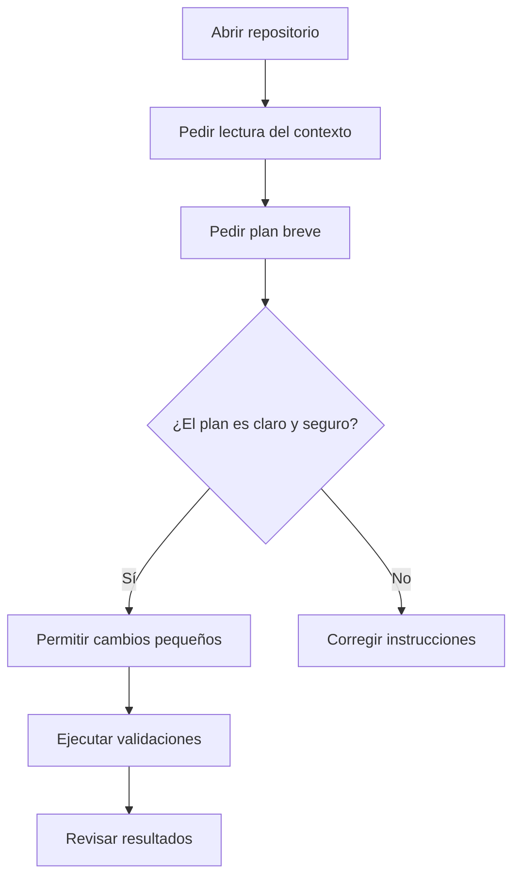

# Asistentes de código

tags: #herramientas #codigo #ia

Los asistentes de código son herramientas de IA que trabajan dentro de una carpeta de proyecto. Pueden leer archivos, proponer cambios, escribir código y ejecutar comandos.

En este vault se mencionan principalmente:

- [[04-herramientas-ia/claude-code-y-codex|Claude Code y Codex]]
- [[04-herramientas-ia/codex|Codex]]

## Cuándo usarlos

Úsalos cuando necesitas:

- revisar la estructura del vault;
- crear o modificar scripts Python;
- crear notebooks;
- revisar links de Obsidian;
- mejorar un HTML interactivo;
- validar que los ejemplos funcionen.

No son necesarios para:

- leer una nota;
- entender un concepto básico;
- hacer una pregunta rápida;
- revisar una tabla pequeña en una herramienta web.

Para eso puede bastar [[04-herramientas-ia/chatgpt-web|ChatGPT web]] o [[04-herramientas-ia/claude|Claude]].

## Flujo seguro

## Regla de seguridad

Antes de aceptar que la herramienta edite o ejecute comandos, revisa:

- qué archivo quiere cambiar;
- por qué lo quiere cambiar;
- si va a usar datos reales;
- si va a instalar algo;
- si va a hacer commit o push.

## Guía operativa

La guía con instalación, comandos y prompts está en:

- [[04-herramientas-ia/claude-code-y-codex|Usar este vault con Claude Code y Codex]]

## Relacionado

- [[04-herramientas-ia/comparacion-herramientas|Comparación de herramientas]]
- [[06-recursos/prompts|Banco de prompts]]
- [[06-recursos/ideas-proyectos|Ideas de ampliación y proyectos]]
