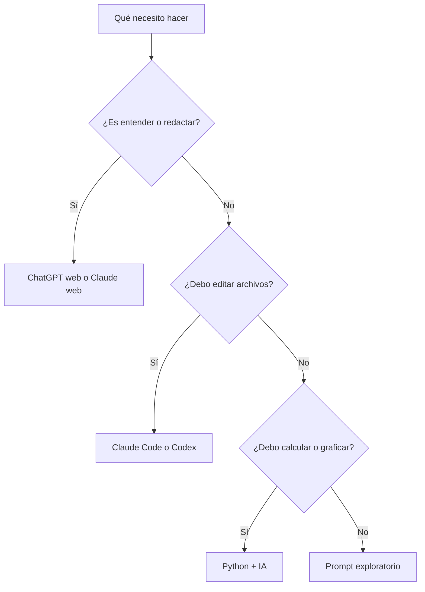

# Comparación de herramientas

tags: #herramientas #comparacion

Esta nota ayuda a elegir herramienta según la tarea. No es una lista de “mejor o peor”; cada herramienta reduce un tipo distinto de esfuerzo.

| Necesidad | Herramienta sugerida | Motivo |
|---|---|---|
| Entender un concepto | [[04-herramientas-ia/chatgpt-web|ChatGPT web]] | Explica, resume y adapta ejemplos rápidamente. |
| Revisar un documento largo | [[04-herramientas-ia/claude|Claude]] | Es útil para estructura, claridad y revisión de textos extensos. |
| Crear o modificar archivos del repositorio | [[04-herramientas-ia/claude-code-y-codex|Claude Code o Codex]] | Trabajan dentro del proyecto, leen archivos y pueden ejecutar validaciones. |
| Crear scripts, notebooks o HTML | [[04-herramientas-ia/codex|Codex]] | Está orientado a programación y edición de código. |
| Analizar o graficar datos | [[03-python-desde-cero/python-moc|Python]] + IA | Python calcula; la IA ayuda a explicar, revisar y comunicar. |
| Preparar una clase o actividad | [[06-recursos/prompts|Banco de prompts]] | Permite pedir estructura, preguntas y actividades con límites claros. |

## Regla de decisión

Empieza por la herramienta que reduce el siguiente paso, no por la herramienta más sofisticada.

## Relacionado

- [[01-conceptos-clave/chatgpt-claude-codex|ChatGPT, Claude y Codex]]
- [[04-herramientas-ia/claude-code-y-codex|Usar este vault con Claude Code y Codex]]
- [[06-recursos/prompts|Banco de prompts]]
