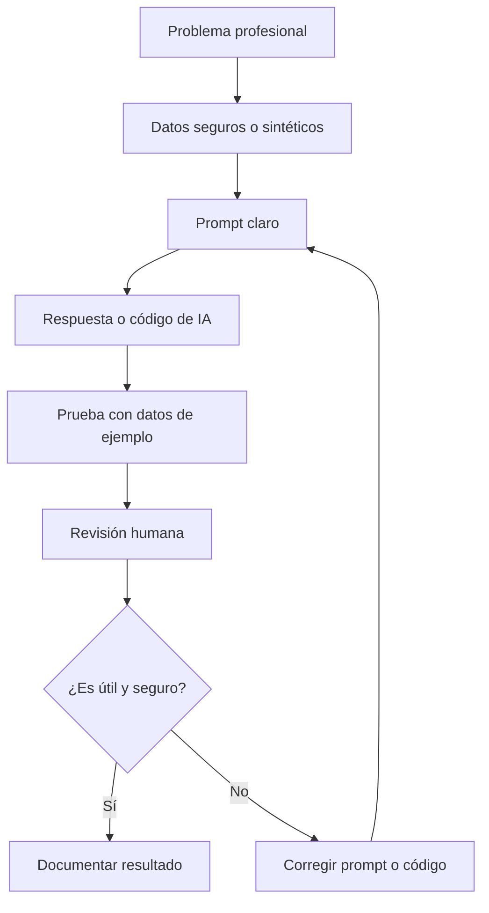
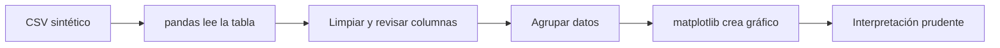
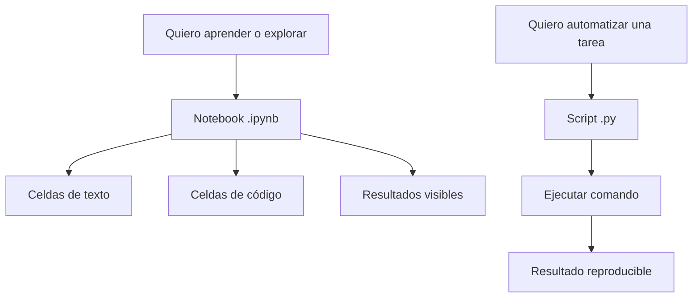
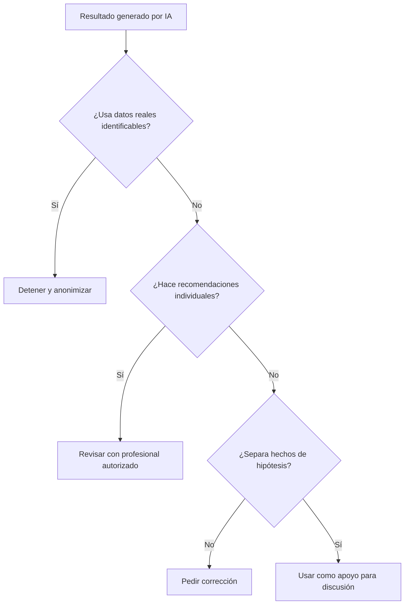
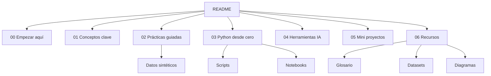
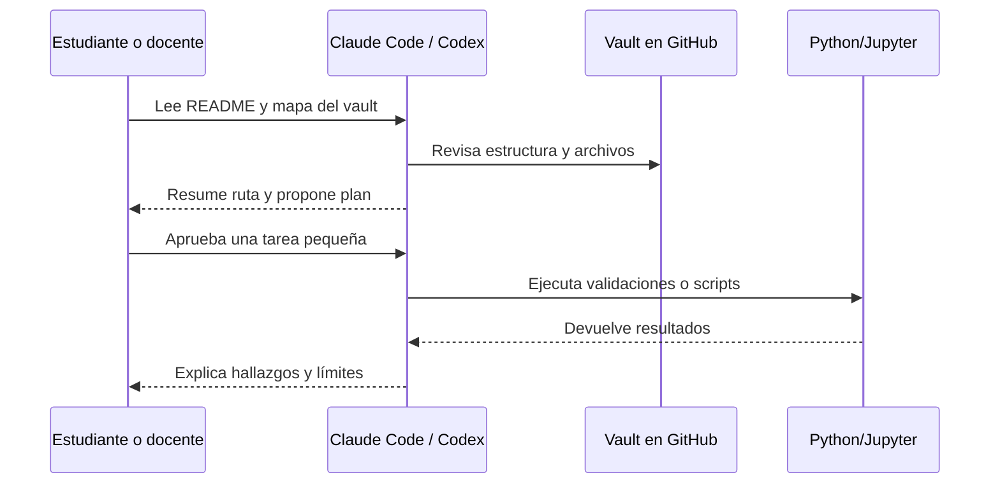
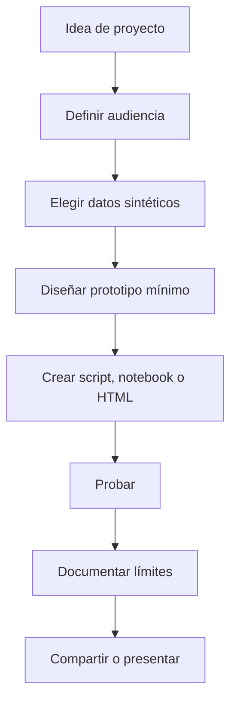
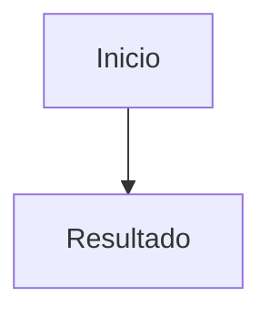

# Diagramas Mermaid

tags: #mermaid #diagramas #recursos #conceptos

Estos diagramas ayudan a explicar visualmente los conceptos centrales del vault. Obsidian y GitHub pueden renderizar Mermaid en bloques de código.

Referencia oficial: <https://mermaid.js.org/intro/>

## 1. Flujo general de trabajo con IA



Idea clave: la IA no reemplaza la validación profesional; ayuda a avanzar más rápido con prototipos y explicaciones.

## 2. De CSV a gráfico con Python



Notas relacionadas:

- [[03-python-desde-cero/leer-datos-csv|Leer datos CSV]]
- [[03-python-desde-cero/graficar-resultados|Graficar resultados]]
- [[02-practicas-guiadas/practica-01-analizar-ausentismo|Práctica 1: analizar ausentismo]]

## 3. Diferencia entre script y notebook



Notas relacionadas:

- [[06-recursos/guia-python-jupyter|Guía de Python y Jupyter Notebooks]]
- [[assets/notebooks/README|Notebooks de ejemplo]]
- [[scripts/README|Scripts de ejemplo]]

## 4. Decisión segura con datos e IA



Notas relacionadas:

- [[01-conceptos-clave/limites-riesgos-etica|Límites, riesgos, ética y privacidad]]
- [[00-empezar-aqui/reglas-de-privacidad|Reglas de privacidad]]

## 5. Arquitectura simple del vault



## 6. Uso de Claude Code o Codex



Notas relacionadas:

- [[04-herramientas-ia/claude-code-y-codex|Usar este vault con Claude Code y Codex]]
- [[06-recursos/prompts|Banco de prompts]]

## 7. De idea a mini proyecto



Notas relacionadas:

- [[06-recursos/ideas-proyectos|Ideas de ampliación y proyectos]]
- [[05-mini-proyectos/mini-proyectos-moc|Mini proyectos]]

## Cómo crear tus propios diagramas

Pídele a una IA:

```text
Crea un diagrama Mermaid tipo flowchart para explicar este proceso a estudiantes principiantes.
Usa máximo 8 nodos, etiquetas cortas y lenguaje claro.
```

Luego pega el resultado en un bloque:

````markdown

````

## Relacionado

- [[06-recursos/glosario|Glosario]]
- [[06-recursos/enlaces-oficiales|Enlaces oficiales]]
- [[04-herramientas-ia/claude-code-y-codex|Usar este vault con Claude Code y Codex]]
